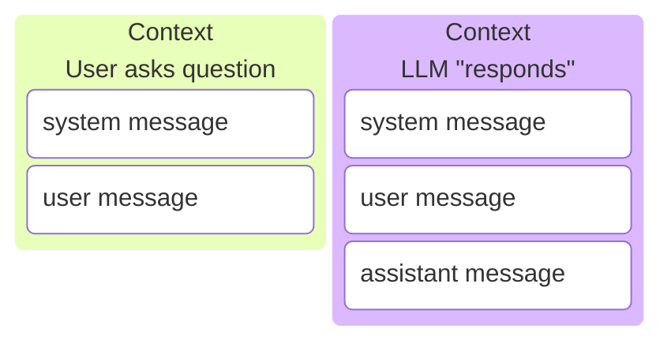

# Why do LLMs need a harness?

Fundamentally LLM APIs are just functions that take a string and concatenate to it.

## What is a harness?

> A LLM harness manages the context sent to the LLM API.

## the first harness: ChatGPT

ChatGPT took your query, appended it to a string they called the **system prompt** and sent it to GPT-3.5 to get a response.

While technically everything is just tokens, these message blocks give us a good abstraction to work with. All modern LLMs are post trained with special tokens demarcating these message blocks.

You can get a feel for how GPUs see the text we send [here](https://tiktokenizer.vercel.app/)

It is important to understand this because if all these sections are made up we can make up our own too.

We manage the context so we can do _almost_ anything we want.

exceptions include:

- LLMs will only generate tokens within assistant blocks
  - meaning they will not generate any other message type (sys, user, tool def, tool result)

meaning we can start the assistant message and make them finish.

## Harness innovations

In cronological order

### Prepended Text: Rules / Memory

Injected by: **Developer**

You have probably seen these as CLAUDE.md/AGENTS.md files

Always in context once added

Note these may be another example of the bitter lesson:
https://arxiv.org/abs/2602.11988

note imo there are two subcategories here

- self generated (generated by llm, these are memory)
- other generated (generated by human or other llm)

### Tools

Invoked by: **Model**

You definitely know these

Can come from harness directly or from MCP connections.

### Commands

Invoked by: **User**

Mostly just reusable prompts with optional parameters.

### Hooks

Invoked by: **Harness**

Run before or after specific events like tool calls, file changes, bash commands, etc. Can be used to run tests, lints, ask for permissions, etc.

### Skills

Invoked by: **Model**

Very large reusuable prompts accompanied with scripts and additional information, aka documentation.

### Ask User Question

Invoked by: **Model**

Technically this is a tool, but it is a special case.

### Plan Mode

> Planning mode is how the AI agent prompts you

Literally directly with the ask user question tool.

- we are now the 'chatbot' and they are the agent.

notice that 'plan mode' does this too. but a little more subtly.

this is very bitter lesson pilled. as models get smarter _we become the bottleneck_. but we are the ones that matter so they still have to ask us questions.

> But as you use theset ools for a bit, you notice something else: _It has good ideas_. It asks good questions. It nudges in compelling directions. It offers options tht you didn't think of, and asks you how you want to fill gaps that you did not realize would be gaps. Though it is not perfect--sometimes you have to grab the wheel back, and take it down an entirely different road--you begin to like it when it drives. Sometimes, this is because you're lazy and don't want to make decisions. But just as often, it's because it's a better driver than you are.

> And in that moment, _who exactly is the intern?_.

# agi pilled harness innovations (unhobblings)

the ones that are model invoked

roughly speaking all harness innovations are just ways to more efficiently use inference time compute

let these models decide what information it needs to collect and _how_ to collect it.

## tools / function calling

allow model to take action in the world

this is the real innovation that unlocked RL

equivalent in importance to o1's inference time scaling innovation

## commands

faster prompts? from user

## todo list

force model to think about steps and update them as it makes progress

## plan mode

force the model to think about approach and propose to user for binary approval before taking write actions

## hooks

linters give fast feedback on code quality and style standards.

## skills

force the user (us) to write down good documentation for the model in a way that is easily digestable and reusuable.

essentially forces us to write SOP docs.

## the ask user question tool

just like the google search tool. except your brain is google and the llm is querying you. right there in the loop.

I think this is the most important tool in the harness
the problem is that it is really annoying since we just want them to work

couldnt the bots always ask us questions? deep research did?
yes, but this tool makes the UI better so we can explicilty choose between multiple options and it is easier to directly respond to each question the bot has.

I predict that subagents will use this tool to ask questions to their orchestrators. which will be the only one to surface questions to the user.

trends:

the goal of the harness is to give the model as fast and high qualityfeedback as possible.

from the prompter (questions answered), from the standards, from the environment (code execution),
